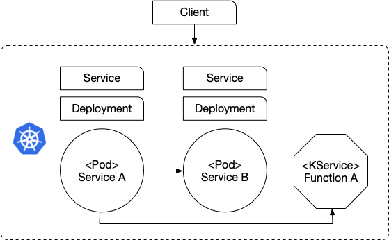
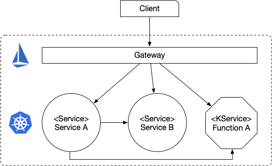
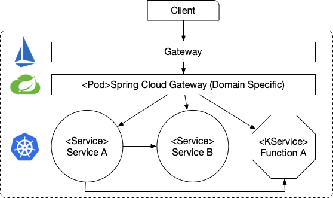
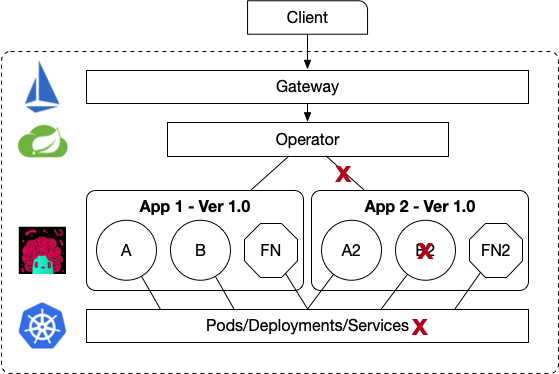

# Extending Kubernetes with Spring Cloud
This repository serves as an index for a workshop like set of excersices about creating our custom resource definitions for Kubernetes using Spring Cloud components. 

During these excersices, you will learn about how to create your custom extensions, deploy them and use them as part of a Kubernetes Operator that will understand the domain specific restrictions that needs to be applied to the infrastructure.
At the end you can find also some useful links to other related projects. 


## Repositories
We will use the following repositories to build our services and our Kubernetes Operator:
- [K8s Operator](https://github.com/salaboy/k8s-operator)
- [Example Service A](https://github.com/salaboy/example-service-a)
- [Example Service B](https://github.com/salaboy/example-service-b)
- [Example Function A](https://github.com/salaboy/example-function-a)

It is recommended to clone all these repos under the same directory, as the following instructions are based in that assumption:
```
mkdir extending-k8s && \
cd extending-k8s && \
git clone https://github.com/salaboy/extending-k8s-with-spring-cloud && \
git clone https://github.com/salaboy/k8s-operator && \
git clone https://github.com/salaboy/example-service-a && \
git clone https://github.com/salaboy/example-service-b && \
git clone https://github.com/salaboy/example-function-a 
```

## Infrastructure

For this tutorial we use Kubernetes, Istio and KNative to demonstrate what can be achieved with a Kubernetes Operator and how that might be done. An Kubernetes Operator doesn't require these technology stack, but due the adoption of these Kubernetes Extensions we believe that it is a good starting place.

### Installation
For setting up the cluster in [GKE you can follow this guide](install.md)

**NOTE**: Remember that you can always find the external IP of your Gateway by running:
```
kubectl get svc istio-ingressgateway -n istio-system
```

## Workshop

This workshop follows the next checkpoints:
- Checkpoint #0: Services A, B and Function A
- Checkpoint #1: Controller v1 (Gateway/Routes)
- Checkpoint #2: Controller v2 (Notify if Service B is missing)
- Checkpoint #3: Operator v1 (CRDs and App)
- Checkpoint #4: Operator v2 (+Checking K8s Services)

## Checkpoint #0: Services A, B and Function A



- [Deploying Service A](#deploying-service-a)
  - See how the service A returns the default answer if B and Function A are not present
- [Deploying Service B](#deploying-service-a)
  - See how A start consuming B
- [Deploying Function A](#deploying-function-a)
  - See how Service A consume Function A



Now that we have our k8s services up and running we can expose them using Istio Gateway to access them from outside the cluster

- [Expose Service A with an Istio Virtual Service + Istio Gateway](#exposing-service-a)
- [Expose Service B with an Istio Virtual Service + Istio Gateway](#exposing-service-b)

## Checkpoint #1: Controller v1 (Gateway/Routes)


- [Setting up RBAC for our Controller](#setting-up-rbac-for-our-controller): ServiceAccount, Role & RoleBinding
- [Deploy Spring Cloud Gateway Controller](#deploy-spring-cloud-gateway-controller)
  - Show basic Routing on K8s service discovery


## Checkpoint #2: Controller v2 (Notify if a Service is missing)
- [Register watch on K8s Services](#register-watch-on-service)
- You can hide and expose services based on business requirements, not yamls

## Checkpoint #3: Operator v1 (CRDs and App)

- [Our CRDs](#our-crds)
  - Deploy CRDs: service-a, service-b and Application
  - Use kubectl to get the resources

## Checkpoint #4: Operator v2 (+Checking K8s Services)

- Deploy version 2 of k8s-operator
  - show code that watch resources changes 
  - Creating custom routes based on CRDs for Applications




# Deploying Service A

This project contains the source code for a very simple service that do the following:
- Every 10 seconds: call Service B (initial delay 5 seconds)
- Every 10 seconds: call Function A

It will print the output of each call or an error message if the services are unavailable.

Let's build and deploy our Service A
```
cd example-service-a/
```


To deploy we need to:
Build the project with maven:
```
mvn clean install
```
Create a docker image with:
```
docker build -t salaboy/example-service-a:0.0.1 .
```


Then push the docker image to be available in hub.docker.com.
> You will need a Docker Hub and replace **salaboy** with your user name. You might also need to do docker login before push.

```
docker push salaboy/example-service-a:0.0.1
```
Finally deploy to our kubernetes cluster with:
```
cd kubernetes/
kubectl apply -f deployment.yaml
kubectl apply -f service.yaml
```
You can take a look at the logs by doing:

```
kubectl logs -f my-service-a-<pod-hash> my-service-a
```

You can find the pod name by ruunning ```kubectl get pods```

## Exposing Service A
Now in order to access our Example Service A service, we need to expose it to clients that are external to the Cluster. 
We can do this with Native Ingress resources or by using the Istio Gateway that is available to us. 

In order to expose our Service using Istio Virtual Services we should run:
```
kubectl apply -f istio-virtual-service.yaml

```
This will create a new Route to access service a at http <EXTERNAL IP>/my-service-a/ 

# Deploying Service B

To deploy example service B follow the same instructions as [Deploying Service A](#deploying-service-a) but in the example-service-b/ directory. 

## Exposing Service B

To expose example service B follow the same instructions as [Exposing Service A](#exposing-service-a) but in the example-service-b/ directory. 

# Deploying Function A

```
cd example-function-a/
```

Build the project with 
```
mvn clean install
```

Create a Docker image for it with

```
docker build -t salaboy/example-function-a:0.0.1 .
```

Then push the docker image to be available in hub.docker.com.
> You will need a Docker Hub and replace **salaboy** with your user name. You might also need to do docker login before push.

```
docker push salaboy/example-function-a:0.0.1
```
Then inside the kubernetes/ directory you can deploy your Knative function to your cluster with
``
kubectl apply -f kservice.yaml
``

You can find the external IP that you can use to call your function:
```
kubectl get svc istio-ingressgateway -n istio-system
```

And then call the function: 

```
http <EXTERNAL IP> 'Host:example-function-a.default.example.com'
```

You should see the function returning a value. 


> Notice that you can customize how the autoscaler scale down your function pods with: 
> ```
> kubectl edit cm config-autoscaler -n knative-serving
>  ```
> and changing the default value to:
> ```
> scale-to-zero-grace-period: "30s"
> ```


# Setting up RBAC for our Controller
Because we are creating an Controller/Operator that is going to access the Kubernetes APIs from inside the cluster (as a Pod) we need to create 3 important resources: Role, RoleBinding and ServiceAccount. 

Then inside the k8s-operator/kubernetes/ directory:

```
kubectl apply -f cluster-role.yaml && \
kubectl apply -f cluster-role-binding.yaml && \
kubectl apply -f service-account.yaml

```

Once we have these resources configured, we can deploy our Operator, you can check that inside the deployment descriptor this Deployment is using the ServiceAccount that we have created before. 

> **Note**: notice that I've created a Cluster wide Role and Role Binding, both extremely permissive. You might want to check the official documentation to configure these resources to be as restrictive as possible for your Operator to work. [ServiceAccounts](https://kubernetes.io/docs/tasks/configure-pod-container/configure-service-account/), [RBAC](https://kubernetes.io/docs/reference/access-authn-authz/rbac/) 


# Deploy Spring Cloud Gateway Controller

```
cd k8s-operator/
```

Let's switch to the **controller** branch

```
git checkout controller
```

Build the project with 
```
mvn clean install
```

Create a Docker image for it with
```
docker build -t salaboy/k8s-operator:controller .
```

Then push the docker image to be available in hub.docker.com.
> You will need a Docker Hub and replace **salaboy** with your user name. You might also need to do docker login before push.

```
docker push salaboy/k8s-operator:controller
```

Finally deploy to our kubernetes cluster with:

```
cd kubernetes && \ 
kubectl apply -f deployment.yaml && \
kubectl apply -f service.yaml
```


# Register watch on service

```
cd k8s-operator/

```

Let's switch to the **controller2** branch

```
git checkout controller2
```

Build the project with 

```
mvn clean install
```

Create a Docker image for it with

```
docker build -t salaboy/k8s-operator:controller2 .
```

Then push the docker image to be available in hub.docker.com.
> You will need a Docker Hub and replace **salaboy** with your user name. You might also need to do docker login before push.

```
docker push salaboy/k8s-operator:controller2
```

Finally deploy to our kubernetes cluster with:

```
cd kubernetes && \ 
kubectl apply -f deployment.yaml && \
kubectl apply -f service.yaml
```

# Our CRDs
As shown in the previous diagrams, we will be defining 3 custom CRDs. Service A, Service B and Application (which aggregates these two types of services).

You can find our Custom Resource Definition in extending-k8s-with-spring-cloud/crds/

We will first deploy the Custom Resource Definition for Service A

```
cd extending-k8s-with-spring-cloud/crds/
kubectl apply -f service-a-crd-definition.yaml
```

This means that now we can do:
```
kubectl get a
```
Now we should get 
```
No resources found.
```

Due we haven't created any instance of this new resource type. 

Let's add the Application CRD now:
```
kubectl apply -f app-crd-definition.yaml
```

we should be able to test it with:

```
kubectl get apps
```

Once again, no resources found is ok.

For the Operator to work, we need to create instance of these resources. We have a couple of instance definitions ready in the same directory, so let's do:

```
kubectl apply -f my-a.yaml
```
This create a new instance of our Custom Resource Definition ServiceA.

Now the following command should return a resource instance:
```
kubectl get a
```
Should return:
```
NAME        AGE
my-a   37s
```

Let's do the same with an Application resource:
```
k apply -f my-app.yaml
```

Now doing: 
```
kubectl get apps
```
should return:
```
NAME     AGE
my-app   47s
```

# Deploying our K8s Operator

Let's switch to the **operator** branch
```
git checkout operator
```

Build the project with 
```
mvn clean install
```
Create a Docker image for it with
```
docker build -t salaboy/k8s-operator:operator .
```
Then push the docker image to be available in hub.docker.com.
> You will need a Docker Hub and replace **salaboy** with your user name. You might also need to do docker login before push.

```
docker push salaboy/k8s-operator:operator
```


In order to deploy our K8s Operator we need to we can run:
```
kubectl apply -f deployment.yaml
```

If you take a look at the logs of the K8s Operator you will see that the pod is running, but it lacks the right resources to operate:
```
kubectl logs -f k8s-operator-<POD name> k8s-operator

// you should see something like:
> Custom CRDs required to work not found please check your installation!
```

This means that we need to provide the Operator the Custom Resource Definitions we need to deploy these resources to make them available to our Cluster. In the crds/ directory we will find two things:
1) Custom Resource Definitions
2) Custom Resource (instance) 


@TODO: when we deploy a new service A we can create a new virtual service to expose on the Istio Gateway.
@TODO: add mock route for apps/my-app/ 
@TODO: create a branch for ap4k in service A
@TODO: create a branch for jvm-operator
@TODO: create a branch for 
        1) gateway with discovery client
        2) adding CRDS and watches
        3) adding Service Checks to k8s service types

@TODO: add diagrams to this doc one for each step. 


# Links


# Conclusions

Explain the posibilities with KNative, Istio and Kubernetes native resources
